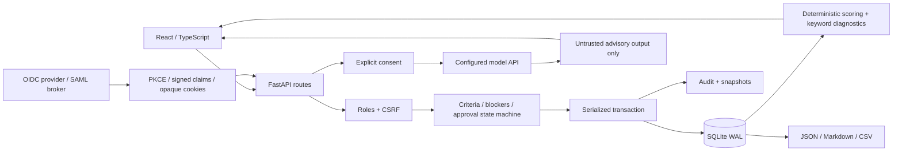

# Release Readiness Board — Ryan Vo

Current version: `1.0.0`.

A full-stack release workspace for collecting evidence, resolving blockers, obtaining independent approvals and exporting an audit-ready release record. It combines an explicit release state machine with deterministic risk diagnostics and optional model advice. Approval authority stays with authenticated humans; a score or model response cannot release anything.

## Workflows

1. **Build the evidence.** Create a draft, add required and optional criteria, record evidence and owners, and pass/fail each review. Track blockers with a severity, classification and resolution or acceptance rationale.
2. **Obtain an independent decision.** Submit for review. A different authenticated subject records an approval, rejection or conditional decision tied to the current evidence revision. Editing evidence increments the revision and invalidates prior decisions. All required criteria must have passing reviews and evidence; unresolved blockers and current rejections/conditions prevent approval.
3. **Publish the release record.** An admin approves the release; an operator or admin can mark it released after a second gate check. Approved evidence is frozen until returned to review. Released records are immutable. Inspect retained audit events, heuristic diagnostics, review/release snapshots and export JSON, Markdown or spreadsheet-safe CSV notes.

## Architecture



Each mutation and its audit entries share one transaction. Requests use a process-level async lock over the domain connection. SQLite persists releases, criteria, blockers, decisions and snapshots. Authentication uses hashed session tokens and a separate connection to the same database file. Use one application worker with a persistent SQLite volume; this release is a single shared workspace, not a multi-tenant or horizontally scaled service.

## Local install

Requirements: Python 3.12+ and Node 20+.

```sh
python3 -m venv .venv
.venv/bin/pip install -r backend/requirements.txt
cd frontend
npm ci
cd ..
```

Run the backend:

```sh
APP_ENV=development DEMO_MODE=true COOKIE_SECURE=false DEMO_BIND_HOST=127.0.0.1 \
  .venv/bin/uvicorn app.main:app --app-dir backend --host 127.0.0.1 --port 8000
```

In another terminal:

```sh
cd frontend
npm run dev
```

Open `http://127.0.0.1:5173`.

For the complete demo flow, sign in as **analyst**, create a draft and add a required criterion. Save its evidence, then pass the review and move to **in review**. Sign out and use **reviewer** to record an independent decision. Sign out and use **admin** to approve and release. These are intentionally separate local demonstration identities; production uses your identity provider. Demo mode refuses production and non-loopback clients. Do not expose a demo server externally.

The default database is `./release_board.db`. Use a file-backed `DATABASE_URL=sqlite:////absolute/path/release.db`; browser sessions and release records need the same persistent database. Do not use separate in-memory databases for production.

## Docker and SSO/SAML

Copy `.env.example` to `.env`, configure the identity provider and public HTTPS URLs, then:

```sh
docker compose up --build -d
```

The frontend binds to `127.0.0.1:8090`; put it behind an HTTPS reverse proxy. The backend is internal and non-root. The named `release-data` volume stores the database. Back it up consistently before upgrades and keep backups outside the container volume. Compose forces `APP_ENV=production`, `DEMO_MODE=false` and secure cookies.

Set `OIDC_ISSUER_URL`, `OIDC_CLIENT_ID`, optional `OIDC_CLIENT_SECRET`, `FRONTEND_URL`, and `OIDC_REDIRECT_URI` (the public origin plus `/api/auth/callback`). The OIDC role claim defaults to `realm_access.roles`; change it using `OIDC_ROLE_CLAIM`. Recognized identity roles are `viewer`, `reviewer`, and `admin`. Reviewers map to the domain API's operator role. Matching is exact; an unrelated role containing the word admin grants no access.

Login uses authorization code flow with PKCE, state, nonce, signed ID-token verification and issuer/audience/time checks. Login state is single-use. Browsers receive an opaque HTTP-only session cookie, not provider access or ID tokens. Mutations require the session's CSRF token. Logout revokes the session in the database.

For **SAML**, connect your SAML identity source to an OIDC broker and configure its OIDC interface here. The application does not parse SAML assertions directly. Roles apply to the whole workspace; there is no per-release access isolation.

## Release gate and revision semantics

- At least one required criterion must exist. Every required criterion must be passed, have evidence, and record a reviewer. Waiving a required criterion does not satisfy the gate.
- Every blocker must be resolved or explicitly accepted. Mitigation alone is insufficient. Record a substantive rationale when resolving or accepting risk.
- Only independent subjects can record approval decisions; the release creator cannot approve their own release. At least one current independent approval is required. The latest decision per approver on the current evidence revision counts; any current rejection or conditional decision blocks release.
- Criteria, blockers and release metadata edits increment the evidence revision. Decisions on earlier revisions remain visible as historical records and do not count. Editing reviewed criteria resets their review to pending.
- Approved and released evidence cannot be edited. Return an approved release to review to change it; doing so invalidates its prior approvals. Revoking a decision on an approved release also returns it to review. Released records and their approvals cannot be deleted or revoked.
- Domain changes, audit entries and review/release snapshots commit atomically. A failed audit write rolls back the corresponding mutation. Transactions serialize decisions and evidence checks; they do not offer collaborative field-level merge or optimistic UI editing.
- Cancelled releases may return to draft. An admin may delete an unreleased release, removing its dependent evidence while retaining audit history.

## Risk interpretation and AI/ML evaluation

The risk index uses explicit fixed feature weights: criterion pass rates, required pass rates, blocker density/severity, current decision ratios, evidence coverage, waivers, ownership and deadline proximity. Keyword matching proposes blocker categories and shows confidence as a relative keyword-match score. Neither value is a trained model output or a calibrated probability of release failure.

The Insights tab shows the real evidence gate separately from the heuristic score. The `/api/evaluation` endpoint returns every case in a small seven-case diagnostic corpus: risk changes under blockers/failing criteria and known keyword classification examples. It is reproducible regression evidence, not broad accuracy. Review/release snapshots support historical heuristic pattern reporting; a trend is descriptive, not a forecast.

```sh
.venv/bin/python -m pytest backend/tests -q
PYTHONPATH=backend .venv/bin/python -m app.services.evaluation
cd frontend
npm run build
npm test -- --run
```

Tests cover atomic audit rollback, independent approval, evidence-bound decision validity, released-state freezing, revocation, API lifecycle, CSRF/logout, signed OIDC claims and replay protection, provider protocols and malformed responses, as well as frontend evidence and consent behavior. CI also builds both Docker images.

## Optional provider-neutral advice

`LLM_API_KEY` is the sole credential variable. `LLM_PROVIDER=auto` recognizes common Anthropic and Gemini key families and otherwise uses an OpenAI-compatible adapter. Explicit choices are `openai-compatible`, `anthropic`, `gemini`, or `ollama`. A custom endpoint requires `LLM_BASE_URL` and, where necessary, `LLM_MODEL`; an API key cannot identify every private gateway. Local Ollama needs no key.

Advice is explicitly requested by an authenticated operator with `{"consent":true}`. Summary analysis sends release metadata, counts and the heuristic score; the blocker-summary API additionally sends blocker text. Do not send sensitive evidence without permission. No requests happen in the background. Provider usage and costs are controlled by your provider account.

Requests have a 30-second timeout, a 40,000-character input cap and a 128 KB output cap. Responses must satisfy a bounded JSON structure. The UI labels output as unverified advice; model confidence is self-reported and uncalibrated. Invalid output or provider errors return a safe error without exposing keys or upstream response bodies. The database transaction is released before network calls. Advice never changes releases, criteria, blockers or approvals.

## API reference

OpenAPI: `/openapi.json`; interactive documentation: `/docs`. Authentication endpoints are `/api/auth/login`, `/api/auth/callback`, `/api/auth/me`, `/api/auth/mode`, and POST `/api/auth/logout`. Use the HTTP-only session cookie and `X-CSRF-Token` from `/api/auth/me` for mutations.

| Method | Path | Role / behavior |
|---|---|---|
| GET | `/api/health` | Public health and version |
| GET / POST | `/api/releases/` | Viewer list / operator create; paginated list supports status/search |
| GET / PUT / DELETE | `/api/releases/{id}` | Viewer read / operator edit / admin delete unreleased record |
| POST | `/api/releases/{id}/transition` | Operator transition; admin required for approved |
| GET | `/api/releases/{id}/risk-assessment` | Viewer; heuristic diagnostics and actual evidence gate |
| GET | `/api/releases/{id}/release-notes` | Structured release record |
| GET | `/api/releases/{id}/export/{json,markdown,csv}` | Download release notes and evidence |
| POST | `/api/criteria/` | Operator; release_id, name, category, required |
| GET | `/api/criteria/release/{id}` | Criteria list |
| PUT / DELETE | `/api/criteria/{id}` | Edit evidence/owner or delete while editable |
| POST | `/api/criteria/{id}/review` | Operator; passed, failed or waived |
| POST | `/api/blockers/` | Operator; release_id, title, description, severity |
| GET | `/api/blockers/release/{id}` | Blocker list |
| PUT / DELETE | `/api/blockers/{id}` | Change state/rationale or delete while editable |
| POST | `/api/approvals/` | Independent operator; release_id, decision, conditions/comment |
| GET | `/api/approvals/release/{id}` | Full decision history including evidence revision |
| DELETE | `/api/approvals/{id}` | Admin revocation before release |
| GET | `/api/audit/release/{id}` | Paginated release events |
| GET | `/api/audit/release/{id}/export` | Operator audit export |
| GET | `/api/evaluation` | Authenticated deterministic diagnostic corpus |
| POST | `/api/llm/analyze/{id}` | Operator, explicit consent, summary metadata |
| POST | `/api/llm/summarize-blockers/{id}` | Operator, explicit consent, blocker text |

CSV cells are protected against common formula prefixes. Markdown wraps imported content in a variable-length fenced JSON block to prevent embedded formatting from becoming active markup. Text evidence is retained as entered; the application does not fetch evidence URLs or verify that user-entered statements are true. Human reviewers must inspect the underlying evidence.

This deployment retains workspace records until an admin removes unreleased work; audit events and released records remain. Plan database backup/archival according to your organization's retention requirements. It is not a tamper-proof external ledger: an administrator with database access can alter files.

## Ownership

Ryan Vo · [ryandtvo@gmail.com](mailto:ryandtvo@gmail.com) · MIT license.
